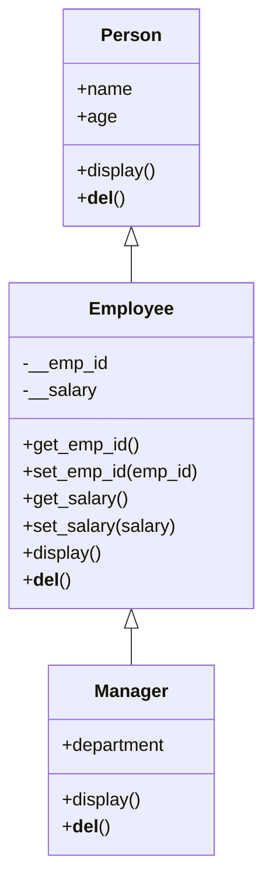

# 🧑‍💼 Employee Management System


A console-based Python application that demonstrates core **Object-Oriented Programming (OOP)** principles — inheritance, encapsulation, polymorphism, and destructors — through a simple three-tier class hierarchy:

```
Person → Employee → Manager
```

---

## 📑 Table of Contents

- [Features](#-features)
- [Class Hierarchy](#️-class-hierarchy)
- [OOP Concepts Demonstrated](#-oop-concepts-demonstrated)
- [Getting Started](#-getting-started)
- [Usage](#-usage)
- [Example Session](#-example-session)
- [Known Limitations](#️-known-limitations)
- [Roadmap](#️-roadmap--ideas-for-contributors)
- [Contributing](#-contributing)
- [License](#-license)

---

## ✨ Features

- 🖥️ Interactive, menu-driven command-line interface
- 👤 Create `Person`, `Employee`, and `Manager` records
- 🔍 View details for any created record, with each class displaying its own relevant fields
- 🔒 Encapsulated employee data — `emp_id` and `salary` are private and accessed only through getters/setters
- 🧬 Built-in inheritance checks using `issubclass()`
- 🧹 Clean resource teardown via `__del__` destructors on exit

---

## 🏗️ Class Hierarchy



---

## 🧠 OOP Concepts Demonstrated

| Concept | Where it's used |
|---|---|
| **Inheritance** | `Employee` extends `Person`; `Manager` extends `Employee` via `super().__init__()` |
| **Encapsulation** | `__emp_id` and `__salary` are name-mangled private attributes on `Employee`, exposed only through getter/setter methods |
| **Polymorphism** | `Person`, `Employee`, and `Manager` each override `display()` with behavior specific to that class |
| **Method Overriding** | `Manager.display()` reuses `Employee`'s getters instead of touching private attributes directly |
| **Destructors** | Each class defines `__del__()`, printing a message when its instances are cleaned up |
| **Runtime Type Checks** | `issubclass(Employee, Person)` and `issubclass(Manager, Employee)` verify the hierarchy at runtime |

---

## 🚀 Getting Started

### Prerequisites
- Python 3.6 or later (no external dependencies required)

### Installation
```bash
git clone https://github.com/<your-username>/<repo-name>.git
cd <repo-name>
```

### Run it
```bash
python employee_management_system.py
```

---

## 📖 Usage

On launch, you'll see a menu:

```
--- Python OOP Project: Employee Management System ---

Choose an operation:
1. Create a Person
2. Create an Employee
3. Create a Manager
4. Show Details
5. Check Inheritance
6. Exit
```

| Choice | Action |
|---|---|
| `1` | Create a `Person` (name, age) |
| `2` | Create an `Employee` (name, age, employee ID, salary) |
| `3` | Create a `Manager` (name, age, employee ID, salary, department) |
| `4` | Show details of the most recently created Person / Employee / Manager |
| `5` | Verify class relationships using `issubclass()` |
| `6` | Exit and clean up all created objects |

---

## 🧪 Example Session

```
Enter your choice: 3
Enter Name: Asha Patel
Enter Age: 34
Enter Employee ID: E1042
Enter Salary: 95000
Enter Department: Engineering

Manager created with name: Asha Patel, age: 34, ID: E1042, salary: $95000.0, and department: Engineering.

--- Choose another operation ---

Enter your choice: 4
Choose details to show:
1. Person
2. Employee
3. Manager
Enter choice: 3

Manager Details:
Name: Asha Patel
Age: 34
Employee ID: E1042
Salary: 95000.0
Department: Engineering

--- Choose another operation ---

Enter your choice: 5

Inheritance Check:
Employee is subclass of Person: True
Manager is subclass of Employee: True

--- Choose another operation ---

Enter your choice: 6

Exiting the system. All resources have been freed.
Manager resources freed.

Goodbye!
```

---

## ⚠️ Known Limitations

- Only **one instance per type** is kept at a time — creating a new Person/Employee/Manager overwrites the previous one of that same type.
- **No input validation** — non-numeric input for age or salary will raise a `ValueError` and crash the program.
- **No persistence** — all data lives only in memory for the current session.
- Destructor output order on exit depends on Python's garbage collector and isn't strictly guaranteed.

---

## 🗺️ Roadmap / Ideas for Contributors

- [ ] Add input validation with friendly error messages
- [ ] Support storing and listing multiple employees/managers
- [ ] Add persistence (CSV, JSON, or SQLite)
- [ ] Write unit tests (`pytest`) for class behavior
- [ ] Add a `Department` class for richer organizational modeling
- [ ] Add search/update/delete operations for existing records

---

## 🤝 Contributing

Contributions are welcome!

1. Fork the repository
2. Create a feature branch (`git checkout -b feature/your-feature`)
3. Commit your changes (`git commit -m "Add your feature"`)
4. Push to the branch (`git push origin feature/your-feature`)
5. Open a Pull Request

---

## 📄 License

This project doesn't yet include a license file. Add a `LICENSE` (e.g., MIT) to your repository to clarify how others may use, modify, and distribute this code.

---

## 👤 Author

Maintained by **[Your Name]**. Update this section with your name, GitHub profile, and contact details.
